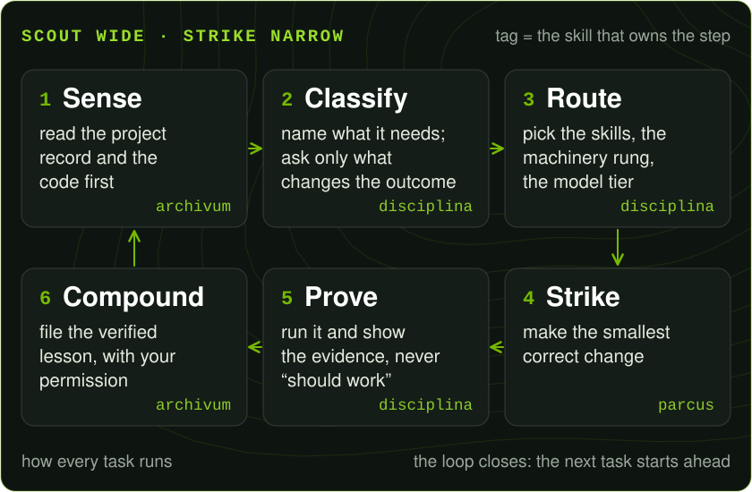
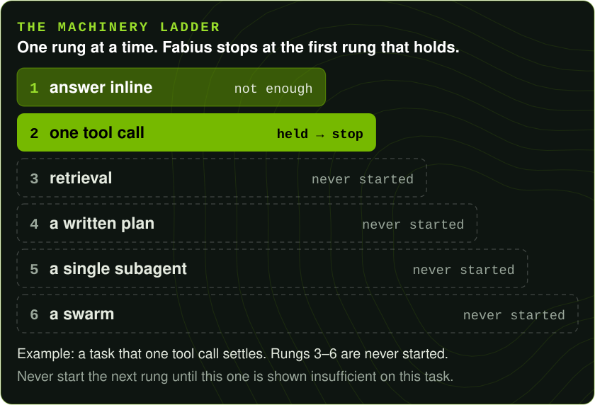
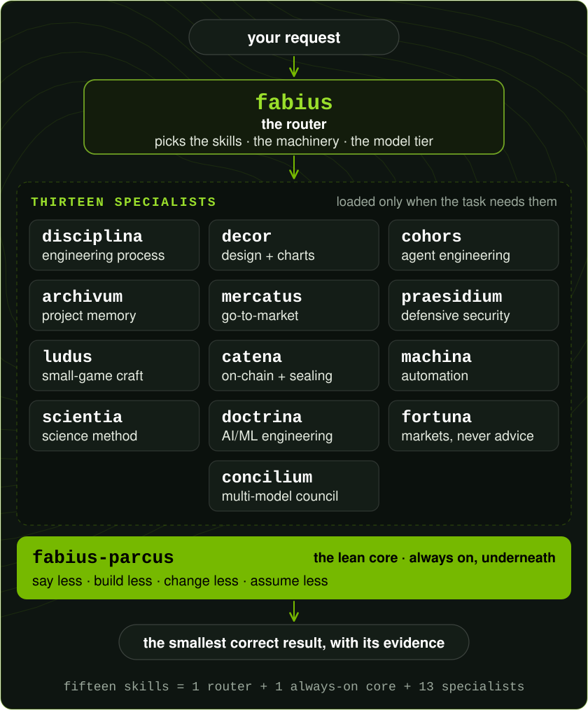

<div align="center">


#### scout wide · strike narrow

*one set of rules above every model*

<a href="#install-in-your-agent-app"></a>

</div>

## What Fabius does

You keep your agent app and the model you already pay for. Fabius adds fifteen skills on top that set how the work gets done: read first, change the least, run the result, show the evidence.

- **Plans before it edits.** It reads the project record and the code, asks only the question whose answer changes the outcome, and gives multi-step work a plan where each step names its check.
- **Uses the smallest machinery that holds.** An answer before a tool call, a plan before an agent, never a swarm when one tool call holds.
- **Proves before it says done.** It runs the change and shows you the evidence. The verdicts are pass, fail, blocked and skip. "Should work" is none of them.
- **Remembers, with your permission.** The project record is one page per project: the brief, the decisions and the open items. It is read in full before the first edit and updated before "done".





Fabius governs how the work is done, never what you want. It states a concern once, then your instruction stands. A new irreversible step earns its own ask, and a missing tool is reported, never faked.

## Fifteen skills, one owner per job



One router, one always-on lean core, thirteen specialists. Twenty-two core routing rules decide which of them a task loads, how much machinery it gets, and which model tier does the work.

Start a prompt with `fabius:` to call the router by name. Agent apps differ in how readily they pick up skills from a plain sentence.

**Build and fix**

- `fabius: we're moving billing from cron scripts to a queue. How should we approach it?`<br/>
  **`fabius`**, the router, reads this as an architecture call: it loads `fabius-disciplina` for the plan, starts at a written plan instead of a swarm, and puts the decision on a strong model tier.
- `fabius: the export endpoint keeps regressing. Walk me through the fix before coding.`<br/>
  **`fabius-disciplina`** reproduces the bug before the patch, maps the change to a test that really reaches it, and ends on one verdict: pass, fail, blocked or skip.
- `fabius: this diff is bigger than the task. Strip it back.`<br/>
  **`fabius-parcus`**, the lean core, ties the diff to the request and reuses your code and the standard library before adding anything. Validation, authorization and accessibility are never trimmed.
- `fabius: make a small arcade shooter with a high-score loop.`<br/>
  **`fabius-ludus`** grey-boxes the ten-second core loop first, then adds juice on purpose, on an explicit state machine, at jam-sized scope.

**Design and copy**

- `fabius: the pricing page looks amateur. Polish it, fix the focus states, and chart signups by month.`<br/>
  **`fabius-decor`** works from named tokens and one accent color, holds WCAG 2.2 AA contrast, titles the chart with its takeaway, and checks the page live in a browser.
- `fabius: write the launch post for this release.`<br/>
  **`fabius-mercatus`** fills a positioning sentence before any copy, swaps claims for evidence, and leaves one next action. Outreach stays a draft. Sending is your act.

**Security and on-chain**

- `fabius: threat-model the file upload endpoint.`<br/>
  **`fabius-praesidium`** runs STRIDE per trust boundary, then an OWASP pass. Every finding ships as severity, fix, regression test. Defensive only.
- `fabius: review this Solidity vault before we deploy, then seal the release.`<br/>
  **`fabius-catena`** checks account validation first, simulates before signing, and never touches a private key. A seal is a hash, a signature and a timestamp reported as pending or confirmed. Defensive only.

**Data, models and research**

- `fabius: is this knockout result supported by the literature? Search PubMed.`<br/>
  **`fabius-scientia`** writes three to five competing, falsifiable hypotheses and traces every fact to a named database.
- `fabius: should we fine-tune, or is RAG enough?`<br/>
  **`fabius-doctrina`** climbs prompt, then RAG, then fine-tune, and decides on a held-out eval against a control.
- `fabius: backtest this moving-average strategy and show the max drawdown.`<br/>
  **`fabius-fortuna`** leads with the risk, states every assumption, sources and dates every figure, and keeps the backtest out-of-sample. Analysis, never personalized advice.
- `fabius: three runs gave the same wrong answer. Convene a council.`<br/>
  **`fabius-concilium`** has several models answer independently and rank each other's anonymized answers, then a chairman model synthesizes, with the full audit trail. It needs your own multi-model API access and does not guarantee beating the best single model.

**Agents, automation and memory**

- `fabius: build a support-ticket triage agent. What permissions should it get?`<br/>
  **`fabius-cohors`** writes the agent spec: a minimum tool allowlist, least privilege, a checkable output contract. One agent unless the work provably splits.
- `fabius: when the form is submitted, email the lead and add a row to the sheet.`<br/>
  **`fabius-machina`** builds the workflow from the automation tool's live schema and tests it on safe sample data before it goes live.
- `fabius: what did we decide last time about the auth flow?`<br/>
  **`fabius-archivum`** answers from the project's page, reads it in full before the first edit, and writes to it only with your permission.

The specialists bring method and knowledge. Live services such as market data, RPC endpoints, GPUs, n8n or database keys are yours to connect.

## Try one you can check

Four starter examples ship with their inputs, results and checks in [examples](examples/README.md). Here is the first, small enough to check by hand:

```text
fabius: summarize this CSV. Show each line total, the sum, and the largest product by revenue.
Do not assume a currency.

product,quantity,unit_price
coffee,3,40
tea,5,18
mug,2,35
```

The saved result is `examples/sales-output.json`:

```json
{"line_totals": {"coffee": 120, "tea": 90, "mug": 70}, "total": 280, "items": 10,
 "largest_product_by_revenue": "coffee", "currency": null}
```

120 + 90 + 70 = 280, and `currency` is `null` because the file names none.

- **Fix a Python bug.** `average()` divided by `len(values) - 1`. The four-line fix in `examples/average.py` raises `ValueError` on an empty list, and the checks hold: `[2, 4, 6]` gives 4, `[5]` gives 5, `[]` raises.
- **Turn meeting notes into next steps.** [Three dated actions](examples/meeting-output.md). The launch-decision owner reads "Unspecified" because the notes never name one, and the result is an unsent draft: nothing was scheduled or sent.
- **Plan a 30-second vertical video.** [Five shots](examples/video-output.md) from the supplied props only, 5 + 6 + 7 + 7 + 5 = 30 seconds, headed "This is a shot list, not a rendered video."

These are demonstrations prepared by the maintainer, not a benchmark. Three larger builds made with Fabius 3.1.0 are live on the [site](https://fabius-landing.vercel.app/#trials): the Lattice product site (28/28 browser scenarios), the Fieldnote task workspace (68/68) and a six-regime math explorer (1,233/1,233 numerical probes). They are worked refinements, not a controlled comparison, and the paired study is published beside them with its ties and misses.

## Install in your agent app

**Claude Code**

```text
/plugin marketplace add shear559/fabius
/plugin install fabius@fabius
/reload-plugins
```

**Codex** (restart Codex afterwards)

```text
codex plugin marketplace add shear559/fabius
codex plugin add fabius@fabius
codex plugin list --marketplace fabius
```

**Grok Build**

```text
grok plugin install shear559/fabius --trust
grok plugin enable fabius
```

It worked when your app lists fabius as installed. Claude Code and Grok Build also show its fifteen skills; in Codex, restart and look for the Fabius skills in a fresh task. Then paste the CSV prompt above and check that the total is 280. Updating, turning it off, removing it and troubleshooting are in the [Quickstart](QUICKSTART.md).

Other instruction-reading tools: [AGENTS.md](AGENTS.md) carries the portable core, without the specialists. Using it outside the marketplace install needs permission.

- **Cost and license.** Proprietary, and free to install for personal, non-commercial use through the marketplace command. Your model, connected services and compute are your own costs. Professional or client work needs permission: [LICENSE](LICENSE).
- **What it touches.** Only the tools and permissions your agent app already grants. No Fabius server, no account, and your model's weights stay as they are. Say `stop fabius` to turn it off for the rest of a conversation.
- **Measured and sealed.** Benchmarks are dated and printed with every miss, including the model tier that scored lower: [BENCHMARKS.md](BENCHMARKS.md). The fifteen skill contracts are content-sealed (SHA-256 and a Merkle root) and releases are signed: [PROVENANCE.md](PROVENANCE.md).
