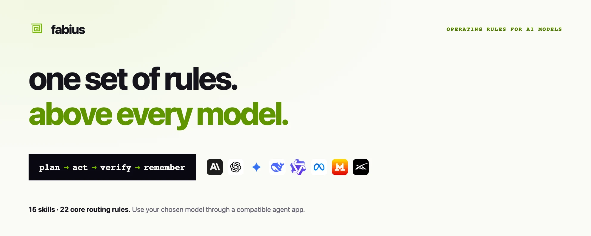

<div align="center">


#### scout wide · strike narrow

*one set of rules above every model*

<br/>



<br/>
<br/>

[](#install-in-your-agent-app)
[](#use-the-same-rules-with-different-models)
[](BENCHMARKS.md)
[](paper/fabius-as-a-system.pdf)

</div>

---

## one set of rules above every model

Fabius is **a shared set of operating rules for AI models**. It guides how a model plans work, selects tools, checks results and uses approved project memory. You keep your model; Fabius supplies a consistent working method.

The rules are organized into **fifteen coordinated skills and twenty-two core routing rules**. A router selects the relevant specialists for the task. Claude, GPT, Gemini and open models can receive the instructions through a compatible agent app; execution depends on the model, available tools and permissions. The research distinguishes mathematical arguments from operational heuristics.

The contract is written down, not implied: [IDENTITY.md](IDENTITY.md) defines the testable objective—whether the same model can produce a better outcome with less waste—not a universal result claimed in advance. The orchestration doctrine (the flow, provider selection, stopping logic, and acting ladder) is [`skills/fabius/references/orchestration-doctrine.md`](skills/fabius/references/orchestration-doctrine.md); the site is **[fabius-landing.vercel.app](https://fabius-landing.vercel.app)**.

---

## Install in your agent app

The rules load into a compatible agent app. Claude Code, Codex and Grok Build use their plugin managers to install the files; other tools can read the portable core instructions in `AGENTS.md`. Installation is free for personal use under [LICENSE](LICENSE); your model, connected services and compute may have separate costs.

**Claude Code**

```
/plugin marketplace add shear559/fabius
/plugin install fabius@fabius
/reload-plugins
```

For background updates, select `/plugin` → Marketplaces → fabius → **Enable auto-update**. An update on disk takes effect after `/reload-plugins` or the next launch; the running session keeps its loaded version until then. [Claude Code update behavior](https://code.claude.com/docs/en/discover-plugins#configure-auto-updates).

**Codex** — use a Codex CLI that supports `codex plugin`:

```sh
codex plugin marketplace add shear559/fabius
codex plugin add fabius@fabius
codex plugin list --marketplace fabius
```

Confirm that the listing reports Fabius installed and enabled, then restart Codex and check that its skills appear in a fresh task. Adding a marketplace or an enabled config entry alone is not an installation check. If `codex plugin --help` is unavailable, update the host before using these commands. The command syntax was checked with Codex CLI 0.153.4 on 2026-09-08.

To update an existing installation, run `codex plugin marketplace upgrade fabius`, then `codex plugin add fabius@fabius`, and repeat the listing and restart checks. Marketplace refresh, installed files and active-session loading are separate states. The host may use a sparse package; do not assume every repository file or a plugin-root `AGENTS.md` becomes active instructions.

**Grok Build**

```
grok plugin install shear559/fabius --trust
grok plugin enable fabius
```

Run `grok plugin details fabius` to inspect its version and component inventory, then reload plugins or start a fresh session. Checked with Grok Build 0.2.103 on 2026-09-08. `grok plugin update fabius` updates an unpinned installation; in this version it skips a saved `@ref`, including a release tag. A pinned installation needs an explicit release transition, followed by another version check. [Grok plugin commands](https://github.com/xai-org/grok-build/blob/main/crates/codegen/xai-grok-pager/docs/user-guide/09-plugins.md).

**Other instruction-reading tools** — [`AGENTS.md`](AGENTS.md) describes the portable core. Copying or adapting it outside the marketplace-use permission requires separate permission under the current [LICENSE](LICENSE). Where authorized, preserve existing project instructions instead of overwriting them. The single file carries the core stance; full specialist workflows also need the relevant skill files and tools.

The repository also includes an optional zero-dependency local runner that reads the sealed contracts: `node runtime/fabius.mjs run "…"`. Its providers, tools and permissions are described in [runtime/README.md](runtime/README.md). Standalone use requires separate permission under the current licence.

Try a concrete task after loading the rules:

- “Review this architecture. Preserve the working boundaries, compare alternatives, and separate design advice from evidence we still need.”
- “Improve this skill from these sources. Update its existing owner, preserve attribution, and test both the intended route and a near-neighbor.”
- “Plan this upgrade. Account for every selected component and show how code, data, and external version pins can be recovered.”

These workflows use your harness's available tools and permissions. Missing execution or live access is reported explicitly. [Architecture decisions](skills/fabius-disciplina/references/architecture-decisions.md) · [Skill maintenance](skills/fabius/references/skill-maintenance.md) · [Transactional updates](skills/fabius-disciplina/references/transactional-updates.md).

---

## Original Fabius capabilities

Version 3.0.0 replaces the imported example libraries with Fabius-authored code and procedures. Four local helpers turn selected rules into deterministic checks and operations, using Node built-ins:

| Capability | What runs | Entry point |
|---|---|---|
| Agent workflows | Explicit roles, validated dependencies, bounded parallelism and failure propagation through a caller-authorized runner | [Cohors scheduler](skills/fabius-cohors/references/catalogue/scheduler.md) |
| Local knowledge | Search selected notes with lexical ranking, line citations and stale-index rejection | [Archivum retrieval](skills/fabius-archivum/references/local-retrieval.md) |
| Design and scenes | Validate semantic tokens and generate an original, seekable HTML storyboard | [Decor kit](skills/fabius-decor/references/design-system.md) |
| Completion evidence | Connect acceptance checks to selected sources and detect missing or stale evidence | [Disciplina ledger](skills/fabius-disciplina/references/engineering-workflows.md) |

These are focused implementations, not copies of upstream frameworks or a claim to reproduce every archived example. Model access, real tool execution and sandboxing remain with the host. [Capabilities and limits](credits/capabilities.json) · [Source history](credits/README.md).

Fabius is developed using the same method: load the relevant rules, define the behavior and its check, implement the change, then inspect the actual result. The LLM generates code and the host executes tools; Fabius supplies the working rules and these local helpers. This is observable use of the system, not a claim that it is an independent model or improves itself without authorization.

## Try one useful task

Start with a task whose result you can check. The [four starter examples](examples/README.md) include the input, a concrete output and its acceptance check.

| Your task | What you get | Check it |
|---|---|---|
| Turn meeting notes into next steps | Decisions, owners, dates and unresolved questions | Every fact traces to the supplied notes |
| Plan a short video | A 30-second shot list using the available props | Timings add up; no claim that a video was rendered |
| Fix a Python average function | A patch and executed boundary tests | Empty, singleton and ordinary lists |
| Summarize a small sales CSV | Per-product totals and the overall sum | `120 + 90 + 70 = 280`; currency remains unspecified |

These are maintainer-prepared demonstrations, not a user study or a performance benchmark. Professional and client use still requires the permission described in [LICENSE](LICENSE).

[Start here](QUICKSTART.md) · [Host compatibility and test status](COMPATIBILITY.md) · [Get help](SUPPORT.md)

## The system


**Fifteen coordinated capability layers with declared ownership** — a router that dispatches by layer · machinery · model-tier, an always-on lean core, and thirteen specialists:

| Layer | Owns |
|---|---|
| `fabius` | the router — selects layers, machinery and model tier; maintains skill ownership and source-backed refinement |
| `fabius-parcus` | the always-on lean core — terse output, the YAGNI ladder, surgical change |
| `fabius-disciplina` | architecture planning/review, state-aware updates, impact-mapped implementation and root-cause debugging |
| `fabius-decor` | ship-grade design — tokens, one accent, a visual-system template captured before building, data-viz, decks + infographics, RTL, review against the generated-UI tells |
| `fabius-cohors` | agent engineering — least privilege, confirmation by action class for agents that act through a screen or channel, standing-job and live-voice shapes, orchestration up to a swarm |
| `fabius-archivum` | permissioned memory — canonical records, legacy migration, gated recall and history; video and source-grounded notebooks as sources |
| `fabius-mercatus` | go-to-market — positioning, converting copy, SEO, draft-only outreach |
| `fabius-praesidium` | defensive security — STRIDE (personal-agent boundaries included), OWASP, the terms gate for connected services, severity → fix → regression test |
| `fabius-ludus` | game craft — core loop first, deliberate juice, jam-sized scope |
| `fabius-catena` | on-chain + sealing — EVM/Solana money-safety, verifiable provenance |
| `fabius-machina` | automation — deterministic workflow wiring, verify before it runs live |
| `fabius-scientia` | science — competing hypotheses, grounded lookups, reproducibility |
| `fabius-doctrina` | AI/ML engineering — train → evaluate → serve → monitor |
| `fabius-fortuna` | markets & finance — risk-first analysis, honest backtests; never advice |
| `fabius-concilium` | cross-model council — blind peer-review across N models, chairman synthesis |

Depth on demand: [ARCHITECTURE.md](ARCHITECTURE.md) · [CORPUS.md](CORPUS.md) · the decision policy in [`skills/fabius/references/routing-policy.md`](skills/fabius/references/routing-policy.md).

---

<details>
<summary>Model-family examples and portability limits</summary>

## Use the same rules with different models

fabius has no required model roster, hosted service, or external runtime: its core is a set of rules the harness hands to whichever model you choose. The repository also includes an optional zero-dependency local runner for use without a harness. Frontier or open-weight, hosted, routed or local: the contract is identical. Thirty-six model families are shown as examples below. Their names do not establish host integration or tested compatibility: skill loading, tool access and instruction-following capability determine what can run.

<table align="center"><tr>
<td align="center" title="Anthropic"><br/><sub><b>Claude</b></sub></td>
<td align="center" title="OpenAI"><br/><sub><b>GPT</b></sub></td>
<td align="center" title="Google"><br/><sub><b>Gemini</b></sub></td>
<td align="center" title="DeepSeek"><br/><sub><b>DeepSeek</b></sub></td>
<td align="center" title="Z.ai · Zhipu"><br/><sub><b>GLM</b></sub></td>
<td align="center" title="Alibaba"><br/><sub><b>Qwen</b></sub></td>
</tr><tr>
<td align="center" title="Meta"><br/><sub><b>Llama</b></sub></td>
<td align="center" title="Mistral AI"><br/><sub><b>Mistral</b></sub></td>
<td align="center" title="Moonshot AI"><br/><sub><b>Kimi</b></sub></td>
<td align="center" title="xAI"><br/><sub><b>Grok</b></sub></td>
<td align="center" title="Cohere"><br/><sub><b>Command</b></sub></td>
<td align="center" title="Google"><br/><sub><b>Gemma</b></sub></td>
</tr><tr>
<td align="center" title="Microsoft"><br/><sub><b>Phi</b></sub></td>
<td align="center" title="NVIDIA"><br/><sub><b>Nemotron</b></sub></td>
<td align="center" title="IBM"><br/><sub><b>Granite</b></sub></td>
<td align="center" title="Amazon"><br/><sub><b>Nova</b></sub></td>
<td align="center" title="Perplexity"><br/><sub><b>Sonar</b></sub></td>
<td align="center" title="MiniMax"><br/><sub><b>MiniMax</b></sub></td>
</tr><tr>
<td align="center" title="Tencent"><br/><sub><b>Hunyuan</b></sub></td>
<td align="center" title="Baidu"><br/><sub><b>ERNIE</b></sub></td>
<td align="center" title="ByteDance"><br/><sub><b>Seed</b></sub></td>
<td align="center" title="StepFun"><br/><sub><b>Step</b></sub></td>
<td align="center" title="01.AI"><br/><sub><b>Yi</b></sub></td>
<td align="center" title="TII"><br/><sub><b>Falcon</b></sub></td>
</tr><tr>
<td align="center" title="AI21 Labs"><br/><sub><b>Jamba</b></sub></td>
<td align="center" title="Reka AI"><br/><sub><b>Reka</b></sub></td>
<td align="center" title="Ai2"><br/><sub><b>OLMo</b></sub></td>
<td align="center" title="Nous Research"><br/><sub><b>Hermes</b></sub></td>
<td align="center" title="Liquid AI"><br/><sub><b>LFM</b></sub></td>
<td align="center" title="LG AI Research"><br/><sub><b>EXAONE</b></sub></td>
</tr><tr>
<td align="center" title="Upstage"><br/><sub><b>Solar</b></sub></td>
<td align="center" title="Xiaomi"><br/><sub><b>MiMo</b></sub></td>
<td align="center" title="Sarvam AI"><br/><sub><b>Sarvam</b></sub></td>
<td align="center" title="Hugging Face"><br/><sub><b>SmolLM</b></sub></td>
<td align="center" title="OpenAI · open weights"><br/><sub><b>GPT-OSS</b></sub></td>
<td align="center" title="Swiss AI"><br/><sub><b>Apertus</b></sub></td>
</tr></table>

<sub>Model and platform marks illustrate example model families and providers ([sources](assets/brands/README.md)); they do not establish tested compatibility, affiliation or endorsement. Execution depends on the chosen host, available tools and permissions. See [compatibility evidence](COMPATIBILITY.md) and [installation and permitted use](#install-in-your-agent-app).</sub>

</details>

## The evidence

One versioned benchmark, four panels, every miss printed: blind-judged quality, a historical track of model-reported execution and model-graded factual checklists, cross-family demonstrations, and the 100-task FBS run of the identity contract. Results are reported per model, panel, and task; they do not establish that every model or domain improves. Reproducibility is limited to the artifacts actually committed, and those limits are printed beside the numbers. Method and receipts: [BENCHMARKS.md](BENCHMARKS.md) · formal arguments and coherence analysis: [the whitepaper](paper/fabius-as-a-system.pdf) (51 pp).

Run the repository checks with `bash scripts/verify-all.sh --mode=dev`. Routing regressions exercise real input phrases; frontmatter controls remove, duplicate and corrupt required fields to test the gate itself. Separate [maintenance smoke scenarios](evals/maintenance-smoke/README.md) retain prompts and observed responses; they are not an additional benchmark panel or a measured quality gain.

---

## Provenance

The fifteen public contracts are content-sealed with SHA-256 and a Merkle root; releases use a signed tag and an OpenTimestamps proof whose verifier reports whether Bitcoin confirmation is complete or still pending. Verify the exact state with `bash provenance/verify.sh`. Details: [PROVENANCE.md](PROVENANCE.md).

---

[Claim boundaries](CLAIMS.md) · [Support](SUPPORT.md) · [Quickstart](QUICKSTART.md)

**Boundaries** — fabius governs *how* the work is done, never *what* you want; `stop fabius` drops the stance. `fabius-praesidium` and `fabius-catena` are defensive only. Lean never trims validation, security, or accessibility.

**License** — proprietary, free to install for personal use ([LICENSE](LICENSE)). Research inputs and retired-source history are recorded in [`credits/`](credits/); separately identified third-party marks and assets retain their own terms.

If a task helped, a [GitHub star](https://github.com/shear559/fabius) is a useful way to bookmark the project. Installation and support never depend on starring.
