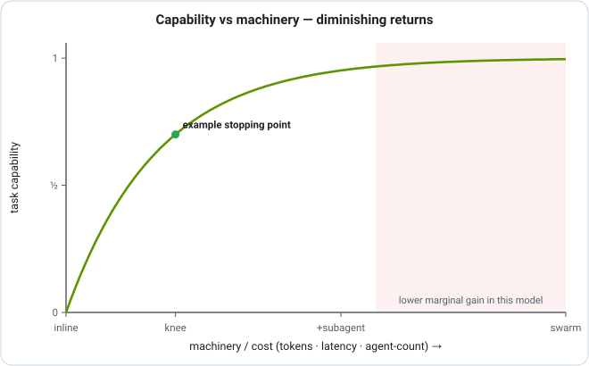
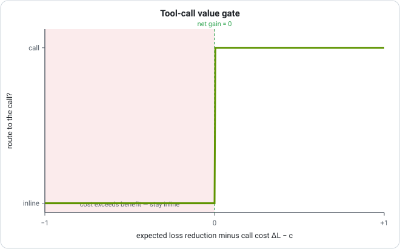
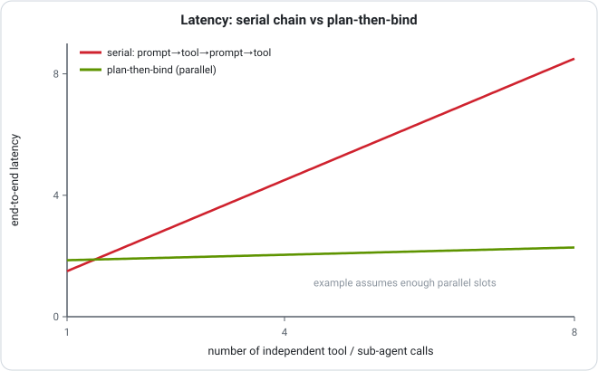
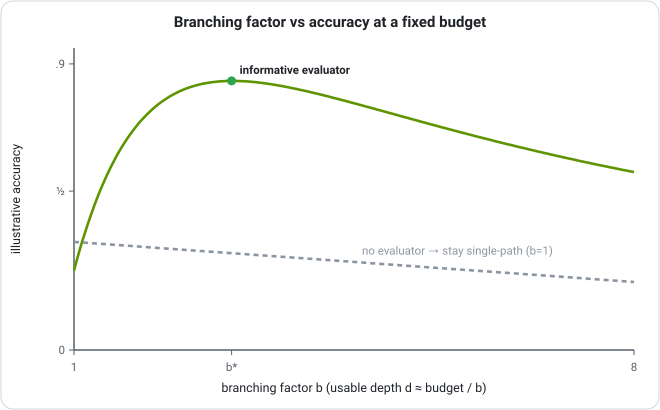
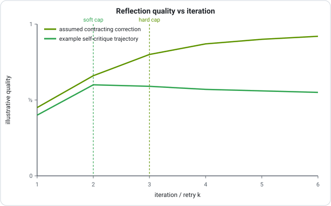
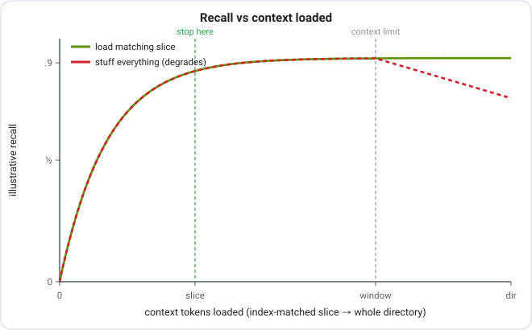
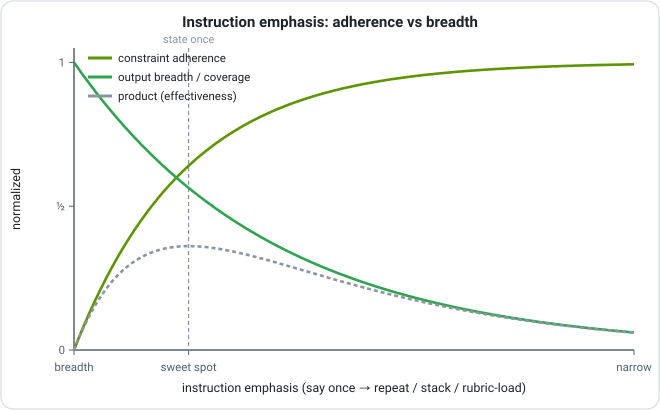

<!-- © 2026 shear559 · fabius · provenance fab1-6bbf82d118bce2cee9d7ac71f034fa26 · release evidence: PROVENANCE.md · github.com/shear559/fabius -->
<div align="center">

# The thinking behind fabius

### How fabius decides — our own research, derived and adversarially verified, stated honestly.

</div>

fabius is a stance, but a stance is only as good as the decisions it makes: *which* layer to route to, *when* to spend a tool call or a second agent, *how long* to keep refining, *what* to load from memory. This document is the reasoning behind those decisions. Each principle is our own — derived from where the agent's work actually gains or loses, turned into an operational rule in [`routing-policy.md`](skills/fabius/references/routing-policy.md), proved where a proof is claimed, and — where a relationship is worth seeing — drawn as a figure.

**The honesty stance, up front.** fabius's quality bar is *measured, not claimed*. Two kinds of rule run through this document. The twenty-two parent rules expand into twenty-six formal blocks: twenty-two conditional mathematical arguments (decision theory · information theory · optimization · scheduling · algebra) and four qualitative rules. The historical mathematical record includes adversarial review; the arguments depend on their stated hypotheses and do not establish model compliance or calibrated estimates. A few are **operational heuristics** (R4, R5, R10, M8b) — control-flow choices stated as such, with no objective function and no proof claim; they advise, and never override a measured gate. Every rule is fabius's own; the boundary between a proved gate and a heuristic is stated inside each one, and the full ledger is at the end. The figures are the shapes the rules assert, computed from the rules themselves — the benchmark measurements live in [BENCHMARKS.md](BENCHMARKS.md).

The formal arguments and qualitative rules — with assumptions, boundaries, and review annotations — is in the whitepaper, [`paper/fabius-as-a-system.pdf`](paper/fabius-as-a-system.pdf).

---

## 1 · Route by classification, then climb one rung

Specialist selection should be reproducible, not vibes. fabius opens every non-trivial task by naming its load on three axes — **Memory, Tools/Action, Planning** — the three loads that, in our own work, decide which layer and machinery a task actually needs. Memory→`archivum`; Planning→`disciplina`; Tools/Action raises `fabius`'s capability ladder to one tool while the domain owner still governs the task. `cohors` enters only for agent engineering or work that genuinely splits across agents; no loaded axis→the lean `parcus` core. A task in a named vertical also routes on a **Domain** axis to its owner — design/data-viz→`decor`, go-to-market→`mercatus`, defensive-security→`praesidium`, games→`ludus`, on-chain/provenance→`catena`, automation→`machina`, science→`scientia`, ML engineering→`doctrina`, markets/finance→`fortuna`, cross-model council→`concilium` — where domain picks *what* and the three load axes pick *how* (run as a studio, R13). The classification *is* the routing rationale **(R1).**

Then it climbs a capability ladder one rung at a time — `inline → one tool → retrieval → plan → single subagent → swarm` — adding the smallest rung the classification demands and stopping **(R2).** Under R2’s concave-value and convex-cost assumptions, a marginal cost-benefit threshold selects the cheaper optimum. Diminishing returns are a model assumption, not a universal measured property of agent machinery.

<div align="center">

</div>

> **Figure 1 — derived shape.** The curve is R2's concave objective drawn out: diminishing returns are what the rule asserts, and the knee is where its stopping test fires. fabius targets the knee and measures real cost per task. The swarm gate is owned by cohors's decomposability test, not by this curve.

---

## 2 · A call must earn its place

Every tool call, sub-agent, or specialist hop is overhead until proven otherwise. The gate is expected value of information: keep a call only if its result **lowers the expected loss of the answer by more than the call costs** — a call that doesn't reduce expected error is dropped. At routing time there is no gold answer to score against, so fabius makes the gate answerable in words: **route only when you can name the specific wrong answer the call prevents** — stale state, a computation you'd botch, an independent reviewer, context past one window **(R3).**

<div align="center">

</div>

> **Figure 2 — derived shape.** The step is R3's threshold drawn out: below it a call is pure overhead, above it the call pays. The expected loss is not observable at routing time, so the operational form of the test is *"can I name the wrong answer this prevents?"*

When the right route is genuinely unclear, fabius doesn't guess on turn one — it keeps **2–3 candidate routes alive** as a weighted preference and lets cheap scouting evidence decide, collapsing to one only as the signal sharpens **(R4, operational heuristic** — *scout wide, strike narrow* as a routing move: it defers the commit and never overrides a value-of-information gate**)**.

---

## 3 · Ground every action; plan in placeholders

Two failure modes haunt multi-step work: reasoning that hallucinates because nothing checks it, and tool-spam that thrashes because nothing plans it. fabius's answer is one per-action invariant — **Reason → Action → Observation**, where the next thought must incorporate the *real* observation: **never act on an assumed result; read the real one first** (re-plan after ~3 stalled cycles) **(R5, operational heuristic — a control-flow invariant, not an optimum).**

When cross-step dependencies or coordination warrant a plan, fabius names the required outputs before binding dependent calls and revises the affected branch as evidence arrives. Independent calls can run together; a routine pair of calls needs no separate plan or checkpoint **(R6).**

<div align="center">

</div>

> **Figure 3 — derived shape.** The two lines are R6's makespan bound drawn out: serial binding sums each reasoning and tool latency; the idealized barrier schedule pays the sum of reasoning costs and overlaps independent tool latencies. This example assumes enough executors and unrestricted overlap. A ready-call streaming schedule has a different DAG, while dependencies, shared limits, and finite executors can remove the illustrated benefit.

---

## 4 · Branch only when you can score a half-finished idea

Branching search is the most over-reached tool in the agent toolbox. R7’s mathematical result is conditional: sample information has zero decision value when the evaluator signal is independent of the relevant state. A scoreable candidate is not automatically an informative signal. The operational policy requires an evaluator whose expected benefit justifies the search cost. So fabius defaults to a single chain and escalates to a scored tree **only when a cheap evaluator can rank unfinished candidates** **(R7).** The cost of being wrong sets how *wide* to search — never *whether* to.

<div align="center">

</div>

> **Figure 4 — illustrative model.** This chosen curve shows a possible width/depth tradeoff. R7’s information-value theorem does not prove an interior optimum for arbitrary tasks or evaluators. Measure the evaluator’s usefulness and search cost before widening.

---

## 5 · Refine on a real signal, and know when to stop

An agent can improve **without fine-tuning** by writing a verbal post-mortem and prepending it to the next attempt — but the stated theorem guarantees geometric error decay when the refinement operator is a contraction on a complete metric space. A real oracle does not establish that assumption; self-critique likewise has no general convergence guarantee. fabius states both as one rule: **enter a refine loop only on an attributable critique** (cite the exact locus + fix), and let the signal type set the budget — a HARD oracle (test, compiler, schema) licenses ~3 aggressive iterations, a SOFT self-critique caps at 1–2, and **no signal means ship once and route to human review** **(R8).** Failed routes leave a lesson in [`failures.md`](skills/fabius/references/failures.md) — the system learns in the prompt, not the weights.

<div align="center">

</div>

> **Figure 5 — illustrative model.** One chosen curve depicts improvement under a contraction assumption; the other depicts a possible plateau or regression. A hard oracle does not imply contraction, and non-expansiveness alone does not predict this particular soft curve. The ~2 soft /~3 hard caps are operational budgets.

---

## 6 · Memory is paged, not stuffed

fabius treats the model as an **operating system over a memory hierarchy**: a small fast window backed by a large addressable store, with explicit `EVICT` (flush to a page under pressure) and `RECALL` (retrieve on a miss). The governing decision follows — *retrieval-on-demand beats context-stuffing* once the corpus exceeds the window, with a cheap symbolic index in front of the dense pass as the scalable default. fabius's `archivum` is exactly this: read the **index** first, page in only the matching slice, and if it still overflows the budget, **summarize-then-link** rather than inlining — never `cat` a directory "just in case" **(R9, M7).**

<div align="center">

</div>

> **Figure 6 — illustrative model.** The curves illustrate retrieval under a context budget. Actual recall depends on the corpus, index, query, and model; the paging theorem alone does not establish these accuracy curves. Measure recall on the target corpus.

Two more memory rules compound it when the user has opted into the store and the route permits recall: solved-and-**verified** sub-problems can be promoted to a reusable named skill and retrieved before planning a matching task (M6 — a verified skill is a memoized sub-solution). Index entries rank by probability of relevance weighted by load-bearingness, ties breaking toward recency, with grown logs folded into synthesis pages when the summary is shorter than the lines (M8 · M8b · M8c — the recency tie-break is an operational heuristic: order-only, never a scoring stage). Security, incident, rollback, outage, and error-recovery routes apply M12 first and begin from fresh evidence.

---

## 7 · Steer narrow contracts hard; say breadth tasks once

Instruction emphasis is a dial that trades adherence for breadth: pushing harder on a condition sharpens adherence but collapses variety. fabius states it as one rule — **piling on emphasis buys adherence at the cost of breadth and over-literalness.** So it hard-steers narrow contracts (format, security, output shape) and says breadth tasks (brainstorm, scout, design-explore) *once*; when a route turns rigid, it *loosens* rather than adds **(R10, operational heuristic).** This is scout-wide / strike-narrow expressed as a control knob.

<div align="center">

</div>

> **Figure 7 — illustrative heuristic.** The chosen curves depict one possible tradeoff between adherence and breadth. Neither monotonic behavior nor an interior optimum is established for every prompt or model; measure both on the target task.

---

## 8 · Orchestration — the management rules

The same discipline governs how fabius runs other agents (`fabius-cohors`):

- **Spawn only to prevent a named error** (M1 — R3's gate applied to team size) — single agent unless work splits, needs an independent reviewer, or overflows one window.
- **Tree vs graph by whether partials merge** (M2 — a reducer is licensed exactly by associativity) — combinable results get a reducer; competing branches get best-of-k.
- **Verification depth from measured failure** (M3 — optimal depth exists only because the route fails) — more correction where a route has been failing, none where it never fails (YAGNI).
- **Reflect-then-retry, escalate when hypotheses run out** (M4 — optimal stopping on the retry hazard).
- **Agents are contracts; accept rewrites only on a metric delta** (M5 — held-out risk, not vibes) — fabius's "measured, not claimed" bar applied to prompt engineering itself.

---

## Mathematical foundations — fabius routing policy (R1–R10 · M1–M8)

Each rule → its formal statement → its mathematical domain → whether the math *governs* the routing decision (**real-math**) or the rule is an operational heuristic stated as such, with no proof claim (**heuristic**). Heuristic rules carry that label in the policy inline.

| Rule | Formal statement | Domain | real / heuristic |
|---|---|---|---|
| **R1** | A measurable task classifier into {0,1}³ defines eight possible labels and at most eight nonempty level sets. A total selector covers every declared label; classification accuracy and current multi-owner composition require separate checks. | decision theory / statistical classification — measurable partition of the decision space | **real-math** |
| **R2** | Over a finite capability ladder n∈{0..N} with V(n) discrete-concave, C(n) convex, U=V−C: stop at n* = min{n : ΔV(n) ≤ ΔC(n)} (=N if empty). The diminishing-returns knee = optimum of a concave objective; '≤' stops at the cheaper rung on ties. | optimization / economics — concave expected-utility maximization, marginal benefit = marginal cost | **real-math** |
| **R3** | CALL iff E[L\|inline] − E[L\|call] > c_call (EVOI>0); optimal expected loss = min(E[L\|inline], E[L\|call]+c_call). Non-trivial in BOTH directions: a faulty call can make E[L\|call] > E[L\|inline]. Distinct from the EVPI≥0 theorem (which re-optimizes over an action set that still includes the inline answer). | decision theory / information economics — expected value of information | **real-math** |
| **R4** | Scout 2–3 routes: on an ambiguous task hold a weighted preference over 2–3 candidate routes and commit only once the integrated scouting evidence separates them. An operational heuristic — no objective function; it defers the commit and never overrides a value-of-information gate. | routing control flow — scout wide, strike narrow | **heuristic** (defers the commit; advises, never governs) |
| **R5** | Reason→act→observe invariant: gate each Action on the prior REAL Observation; never stack an action on an assumed result; re-plan after ~3 no-movement cycles. A control-flow invariant, not an optimization. | agent control flow — the per-step gate (vs disciplina's terminal prove-gate) | **heuristic** (qualitative; a control-flow invariant, not an optimization) |
| **R6** | For independent calls with enough freely overlapping executors: serial schedule T_serial=Σ(r_i+t_i); imposed plan-barrier schedule T_plan=Σr_i+max_i t_i. S→n for equal calls as reasoning/tool latency→0; span/work bounds apply to each schedule’s actual DAG. | scheduling / parallel computation — critical-path makespan, work/span bounds | **real-math** |
| **R7** | Branch iff VOI(E)=EVSI(E)=E_s[max_a E_{x\|s}U] − max_a E_x U > c_search; gain=0 when signal⊥state (any branching factor), and 0≤VOI(E)≤EVPI. No cheap evaluator ⇒ collapse to single chain. | decision theory — expected value of sample / perfect information | **real-math** (the illustrated interior optimum is not implied by the theorem) |
| **R8** | Refine loop x_{k+1}=T(x_k). If the space is complete and T is a contraction L<1, a unique fixed point exists and e_k≤Lᵏe_0. Non-expansiveness and a no-signal martingale are separate hypothetical models. Hard-oracle availability implies none of these properties; ~3 hard /1–2 soft passes are operational budgets. | stochastic processes / fixed-point — contraction mapping | **real-math** (contraction); caps are operational budgets |
| **R9** | Retrieve under token budget B: choose S⊆pages maximizing relevance f(S) s.t. Σlen(p)≤B. Monotone submodular f ⇒ cost-benefit greedy (gain-per-token) + partial enumeration achieves (1−1/e); plain greedy can be arbitrarily bad. | information theory / combinatorial optimization — submodular maximization under a knapsack constraint | **real-math** (governs a model of relevance, not downstream LLM accuracy) |
| **R9b** | Index-first prefilter: narrow U→C⊆U by a cheap symbolic test, cutting search entropy log₂\|U\|→log₂\|C\|, an expected reduction = mutual information I(target;index)=H(target)−H(target\|index). Cascade cost c_index·\|U\|+c_rerank·\|C\|, c_index≪c_rerank; recall@C≈1 if the test is relevance-monotone. | information theory / IR — multi-stage retrieval cascade, MI search-space reduction | **real-math** |
| **R9c** | Over-budget ⇒ summarize-then-link at rate B: R(D)=min_{p(ŝ\|s):E[d]≤D} I(S;Ŝ); operate at R=B, accept D(B); the [[slug]] link preserves a zero-distortion recovery path (lossy on the inlined view, not the stored truth). | information theory — rate–distortion; information bottleneck as the relevance-weighted case | **real-math** |
| **R10** | State a breadth task once, hard-steer only narrow contracts. Emphasis w is a dial: w↑ raises adherence to the constraint and shrinks the breadth of candidate outputs (bias↑/variance↓); tune it to the contract and measure both. An operational heuristic — directional, no objective function. | instruction control — emphasis as a dial | **heuristic** (directional: emphasis trades breadth for adherence — measure both) |
| **M1** | Spawn 2nd agent iff E[L\|single] − E[L\|+agent] > c_agent (R3's EVOI gate on team size). Reviewer case: p(both miss)=p_author·p_checker < p_author under error independence (decorrelated-error argument). | decision theory / economics of organization — VOI gate on team size; independent-error factorization | **real-math** |
| **M2** | Order-preserving parallel (tree) reduction = serial left-fold for ALL inputs iff ⊕ associative (semigroup); identity e ⇒ monoid ⇒ reduce(A∥B)=reduce(A)⊕reduce(B). Non-associative ⊕ ⇒ branches compete ⇒ best-of-k = argmax v(x_i), skip merge. | algebra / functional programming — monoid/semigroup homomorphism (map-reduce) | **real-math** |
| **M3** | Verification depth from measured failure q: minimize J(v)=q(1−r(v))C_fail+κv, r concave. Strictly convex for q>0 (linear increasing at q=0) ⇒ unique v*=(r')⁻¹(κ/(qC_fail)); interior/positive iff q·C_fail·r'(0)>κ; ∂v*/∂q>0; q=0⇒v*=0 (YAGNI). Online Beta-Bernoulli posterior q̂. | optimization / economics — convex inspection-effort minimization with a concave detection curve; comparative statics | **real-math** (maps to "optimal overhead exists only because the model is imperfect") |
| **M4** | Reflect-then-retry, one-step lookahead: ΔV_{k+1}=p_{k+1}·V_fix − c_retry; CONTINUE while p_{k+1}>c_retry/V_fix. STOP when a reflection repeats the cause (I(R_k;cause\|R_{<k})≈0 ⇒ no hazard lift); cap ~3 since gross gain g_k=p_k·V_fix decays geometrically below the cost threshold. | stochastic processes / decision theory — optimal stopping (myopic one-step lookahead); reflection as a policy update | **real-math** |
| **M5** | Accept prompt rewrite p' over p iff R̂_val(p')<R̂_val(p) on i.i.d. held-out D_val (ERM). Generalization (finite P, loss∈[0,1], concentration + union bound): R(p̂)≤min R(p)+2√((ln\|P\|+ln(2/δ))/2n) w.p. ≥1−δ. | statistical learning theory — empirical risk minimization; held-out validation, concentration + union bound | **real-math** |
| **M6** | Verified skill = memoized sub-solution: table M[s], hit ⇒ O(1) return + verify-predicate, miss ⇒ compute+store. Correctness/speedup from optimal substructure + overlapping subproblems; Θ(2ⁿ)→O(n) collapse; amortized (1−h)c_compute+h·c_lookup, c_lookup≪c_compute. | algorithms / optimization — dynamic programming, memoization; the optimal-substructure + overlapping-subproblems pair | **real-math** |
| **M7** | Two-tier memory: fast tier capacity B + unbounded slow tier. write=EVICT flushes fact f to an addressed page, leaves pointer [[slug]] (ℓ(slug)≪ℓ(f)); LOSSLESS (byte-exact recall) ⇒ total stored info non-decreasing; occupancy≤B held if policy evicts enough. Addresses uniquely decodable by the prefix-code inequality (Σ D^{−ℓ_i}≤1). | information theory + systems — lossless source coding with a codebook (prefix-code inequality); virtual-memory paging | **real-math** |
| **M8** | Rank index entries by descending P(relevant\|query,page) — Probability Ranking Principle, Bayes-optimal cutoff under independent judgements + uniform cost. Load-bearingness enters as a UTILITY weight in the EU generalization: rank by s=u(page)·P(relevant\|q,page), not in bare PRP. | information theory / IR — Probability Ranking Principle; Bayesian ranking under a cutoff | **real-math** |
| **M8b** | Recency tie-break (among pages tied on relevance): order more-recently-edited pages first — a deterministic, order-only tie-break applied after relevance, never a scoring stage that can override it (any monotone decay kernel exp(−λ·Δt) yields the same order, so no λ is fitted). A heuristic, NOT a normalized Bayesian posterior (a true temporal prior would sit inside P(relevant\|·)). | IR — order-only recency tie-break on a curated wiki | **heuristic** (order-only; no fitted decay rate, no importance weight, no calibration claim) |
| **M8c** | Fold grown logs into a synthesis page when the two-part code is strictly cheaper: L(p)+L(L\|p) < Σ L(l_i). Shortest-description criterion — prefer the representation minimizing model cost + data-given-model cost; synthesize exactly when inter-line redundancy exceeds the summary's cost. | information theory — shortest-description (two-part code) criterion; algorithmic-complexity-flavored compression | **real-math** |

| **R11** | Tier cascade as an index policy: adaptivity collapses to a static order (verdict-path lemma); adjacent exchange gives Δ=q·p_i·p_k(ρ_i−ρ_k) with ρ_i=c_i/p_i (a reservation-value index; the ordering half of the sequential-search rule at Bernoulli boxes) ⇒ ρ-sorted cascade optimal in the equal-guarantee class; per-tier gate p_iW>c_i ⇔ W>ρ_i — R3's EVOI gate verbatim, over tiers. | decision theory / sequential search — exchange argument, reservation index | **real-math** |
| **R12** | Dual exit gate C∧D: false-stop factorization cuts the error vs either gate alone (dependence caveat stated); hard cap N + R8's no-progress stall test ⇒ almost-sure termination with bounded expected cost — optimal stopping with M4's hazard object lifted from attempt scale to cycle scale. | stochastic processes / optimal stopping | **real-math** |
| **R13** | Studio composition theorem: single-owner assignment (R1's partition + a domain bit) ⇒ conflict-freedom (set-collapse lemma); the layer order D≺P≺E≺F is acyclic ⇒ terminating; downstream refinement confined to own concern-variables preserves the domain goal. Threshold in form (k(t)≥2 gate); structural at heart — stated as such. | order / composition theory — the system's own contract, formalized | **real-math** |
| **M9** | Externalization as lossless paging: context cost O(i+s) vs O(B) bundled, i+s≪B; dominance gate = explicit recall threshold ρ* (miss-cost-weighted expected utility) — externalization weakly dominates when index recall ρ≥ρ*; this is sufficient, not necessary, and the theorem is silent below ρ* (measurement decides). | information theory / systems — paging bound + EU dominance threshold | **real-math** |

**Legend.** (R11–R13 · M9 — the four system rules, all **real-math**; proofs in the whitepaper §4.7.) **real-math** = a mathematical argument conditional on its explicit assumptions; the record includes adversarial review. It does not mean the plugin measures every parameter or enforces the modeled procedure. **heuristic** = an operational rule stated as such — a control-flow or tuning choice with no objective function and no proof claim; it advises and never overrides a measured gate. Four heuristic rules: R4 (scout wide), R5 (reason → act → observe), R10 (the emphasis dial), M8b (the recency tie-break).


### Composition — the 22 rules are one pipeline

The abstract procedure assigns an **acyclic order within each bounded pass** — stages consume prior decisions. Termination depends on the finite counters and terminating actions assumed by the model; stopping may produce a verified artifact or an explicit incomplete result. Recording is a conditional branch: it fires only when an opted-in store and explicit write authority permit it.

```
parcus  (lean floor — always on, never competes for a task verb)
  ≺ R1   classify the 3 axes {Memory, Tools, Planning}
  ≺ R4   scout 2–3 routes      (only if the classification is ambiguous)
  ≺ R2   capability ladder       (admit the smallest sufficient rung)
  ≺ R3 · M1   tool / 2nd-agent expected-value gate (confirm or veto the rung)
  ≺ R6   plan-then-bind          (identify dependencies; overlap independent calls)
  ≺ R5   reason → act → observe  (per-edge execution invariant)
  ≺ R7 · M2   search topology     (branch only if scorable · tree vs graph)
  ≺ R8 · M3 · M4   refine budget   (signal-typed loop · verify depth · retry-stop)
  ≺ M5 · M6   learning layer        (metric-gated rewrite · authorized write / policy-permitted skill-cache recall)
  ≺ R9* · M7 · M8* · M9   memory branch (only when opt-in + recall/write gates permit; fresh-eyes/trivial routes bypass it)
```

**The full composition — 22 rules.** With the four §4.7 proofs (R11 · R12 · R13 · M9 — all real-math), the composition analysis covers the full set under the entry assumptions. Placement: `R1 ≺ (R4 if ambiguous) ≺ R13 ≺ R2 ≺ R11 ≺ R3·M1 ≺ … ≺ R9*·M7·M8*·M9`, with R11 re-entering dispatch on a verified miss (≤ K−1 escalations per sub-task) and R12 wrapping the whole chain as the externally capped outer loop (≤ N cycles) when work is multi-cycle. **Verdict: conditional composition, with explicit exceptions** in the whitepaper §5 — the honest ones include: R13 fits the threshold family in form only (structural at heart); the "visit each rule once" clause weakens to "once per pass, boundedly many passes" (R11's ≤K−1 escalations, R12's ≤N cycles); R8's verifier verdict becomes a shared read-only single point of trust for three rules; and M9's gate is one-sided sufficient. The frontier layer (R14–R16 · M10–M13) stays outside the theorem by construction.

### Composition assumptions and limits

- **Consistency requires more than matching signs.** Several gates use a cost-benefit threshold, while classification, scheduling, ownership, and qualitative rules have different roles. Shared budgets, verifier results, tier costs, and admission decisions can couple their inputs. Respect the dependency order and mandatory verification floor; no global optimum follows from naming different variables.
- **Coverage concerns declared labels.** A measurable total classifier yields eight possible initial labels and at most eight nonempty cells; R13 adds a domain bit. A defined action for each label proves neither classifier accuracy nor adequacy of the axes for every real task.
- **Termination requires an executor.** Finite sub-task lists, terminating primitive actions, finite tier attempts, and an externally enforced cycle cap make the abstract procedure bounded. A Markdown instruction does not install those controls or establish model compliance.
- **Shared gates need precedence.** M4 and R12 agree at fresh failure (q=0) under matched cost scales; they can differ at other completion beliefs. For q=0.8, p=0.5, and cost/loss=0.2, M4 continues while R12 stops. The outer run-level exit takes precedence over an inner retry.

Four blocks are **qualitative**, not theorems: R4, R5, R10, and M8b. The twenty-two remaining blocks state mathematical arguments with hypotheses such as concavity, contraction, independence, calibration, and ownership locality. Those hypotheses require separate evidence before a formal conclusion can be applied to an actual agent run. The proof record includes review history and the September 2026 accuracy corrections; it is not machine-checked certification.

---

## Honesty ledger

**Conditional mathematical arguments** (assumptions and review history recorded in the whitepaper): the three-axis router as a measurable partition of task-space (R1); the capability-ladder knee as a concave-utility optimum (R2); the call gate as expected value of information (R3, and M1 as the same gate on team size); plan-then-bind as a critical-path bound (R6); branch-only-when-scorable as expected value of sample information (R7); the signal-typed refine loop as a contraction argument (R8) and reflect-then-retry as optimal stopping (M4); the reducer licensed by associativity (M2); verification depth as a convex inspection problem (M3); rewrite-on-held-out-risk as empirical risk minimization (M5); the verified skill as a memoized sub-solution (M6); paged memory as lossless coding, submodular retrieval, rate–distortion and ranking by probability of relevance (R9 · R9b · R9c · M7 · M8 · M8c); and the four system rules — tier cascade, dual exit gate, studio composition, externalization (R11 · R12 · R13 · M9).

**Derived, and stated as heuristics** (an operational rule with no objective function and no proof claim; it advises, and never overrides a measured gate): scout wide (R4); reason → act → observe as a control-flow invariant (R5); the emphasis dial (R10); the order-only recency tie-break (M8b). The specific budgets inside the rules — ~2 soft / ~3 hard refine passes (R8), ~3 stalled cycles before a re-plan (R5), 2–3 scouted routes (R4) — are fabius's operational settings, not derived constants.

**Measured** (numbers, with method, controls and misses printed): the benchmark — [BENCHMARKS.md](BENCHMARKS.md). The figures in this document are chosen mathematical illustrations, computed from committed plotting code (`assets/charts/render_figures.py`), never a benchmark curve. The bar held throughout: **measured where we measured it, derived where we derived it, heuristic where it is one — labelled so no claim is overstated.**

---

## Reproduce the figures

The figures are computed, not drawn — `numpy` → SVG, no external services:

```bash
python3 assets/charts/render_figures.py   # writes assets/fig-*.svg
```

The decision policy itself is [`skills/fabius/references/routing-policy.md`](skills/fabius/references/routing-policy.md); the full proofs are in the whitepaper, [`paper/fabius-as-a-system.pdf`](paper/fabius-as-a-system.pdf).
